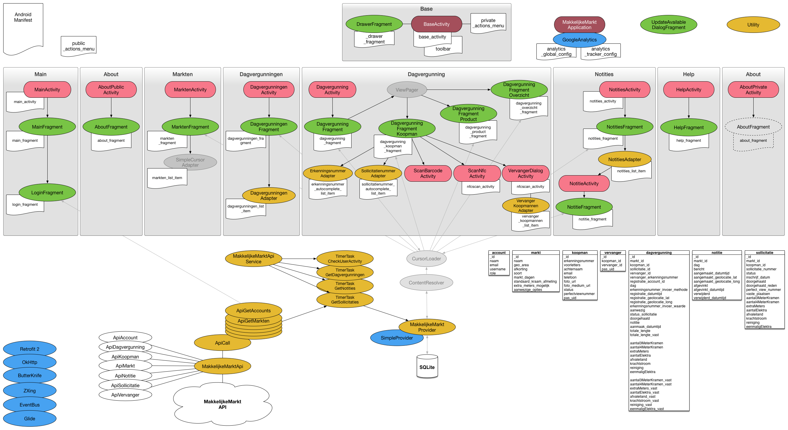

##Makkelijke Markt Android App


###Project setup
Follow these configuration steps to setup the project:


#####1. Set API endpoint

./app/src/main/res/values/properties.xml

```
<string name="makkelijkemarkt_api_base_url" translatable="false">INSERT-API-ENDPONT-HERE</string>
```


#####2. Create secret.xml file containing de API Application key:

./app/src/main/res/values/secret.xml

```
<?xml version="1.0" encoding="utf-8"?>
<resources>

    <!-- Makkelijke Markt App Key -->
    <string name="makkelijkemarkt_api_app_key" translatable="false">INSERT-APP-KEY-HERE</string>

</resources>
```


#####3. Create Google Analytics config:

./app/src/main/res/xml/analytics_tracker_config.xml

```
<?xml version="1.0" encoding="utf-8"?>
<resources>

    <!-- Google Analytics Tracking ID -->
    <string name="ga_trackingId">ADD-GOOGLE-ANALYTICS-TRACKING-ID-HERE</string>

    <!-- Enable uncaught Exception tracking -->
    <bool name="ga_reportUncaughtExceptions">true</bool>

    <!-- Enable automatic Activity tracking -->
    <bool name="ga_autoActivityTracking">true</bool>

    <!-- Activity screenName mappings, for automatic Activity tracking -->
    <screenName name="com.amsterdam.marktbureau.makkelijkemarkt.MainActivity">MainActivity</screenName>
    <screenName name="com.amsterdam.marktbureau.makkelijkemarkt.AboutPrivateActivity">AboutPrivateActivity</screenName>
    <screenName name="com.amsterdam.marktbureau.makkelijkemarkt.AboutPublicActivity">AboutPublicActivity</screenName>
    <screenName name="com.amsterdam.marktbureau.makkelijkemarkt.DagvergunningActivity">DagvergunningActivity</screenName>
    <screenName name="com.amsterdam.marktbureau.makkelijkemarkt.DagvergunningenActivity">DagvergunningenActivity</screenName>
    <screenName name="com.amsterdam.marktbureau.makkelijkemarkt.MarktenActivity">MarktenActivity</screenName>
    <screenName name="com.amsterdam.marktbureau.makkelijkemarkt.NotitieActivity">NotitieActivity</screenName>
    <screenName name="com.amsterdam.marktbureau.makkelijkemarkt.NotitiesActivity">NotitiesActivity</screenName>
    <screenName name="com.amsterdam.marktbureau.makkelijkemarkt.ScanBarcodeActivity">ScanBarcodeActivity</screenName>
    <screenName name="com.amsterdam.marktbureau.makkelijkemarkt.ScanNfcActivity">ScanNfcActivity</screenName>
    <screenName name="com.amsterdam.marktbureau.makkelijkemarkt.VervangerDialogActivity">VervangerDialogActivity</screenName>

</resources>
```


#####4. Disable Google Analytics tracking when not in production by setting ga_dryRun=true:

./app/src/main/res/xml/analytics_global_config.xml

```
<bool name="ga_dryRun">true</bool>
```


###Release notes - v1.0.6
- App updaten optie toegevoegd aan het actions menu
- Check for App update
- Detectie voor 'Locked account'
- Text toetsenbord ter voorbereiding op complex toezichthouder wachtwoord
- Api applicatie key header toegevoegd
- Dagvergunning opslaan pas mogelijk maken nadat de kostprijs berekend is en getoond wordt
- Bug fix voor ontbrekende koopman foto's
- Google Analytics toegevoegd


###Requirements
Android 4.1 Jelly Bean or later (API level 16)


###Documentation

Open the auto-generated [JavaDoc](doc/javadoc/index.html) documention.


###App diagram



